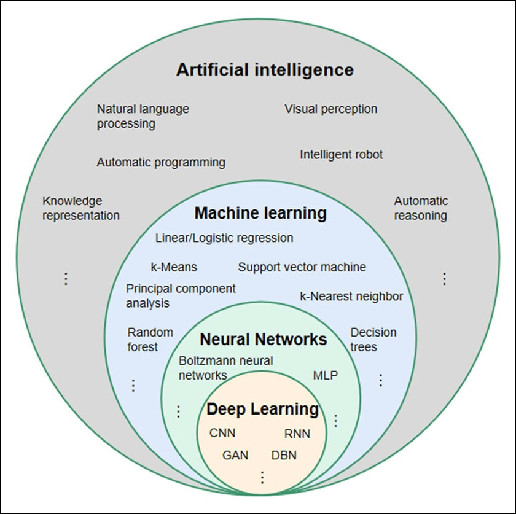
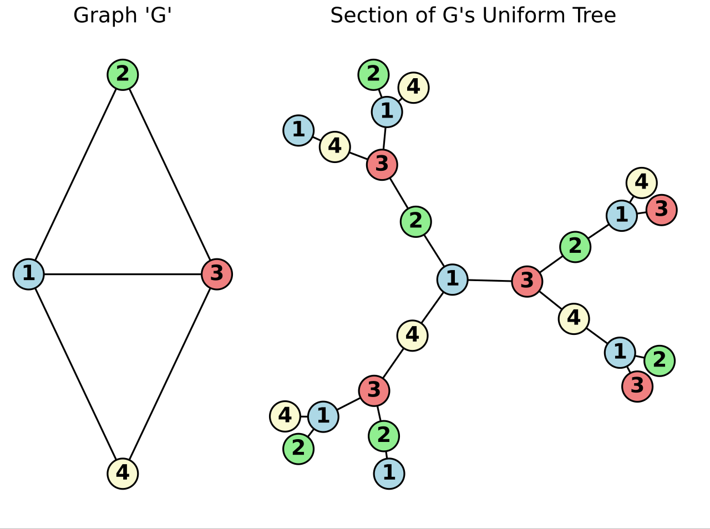

# Семинар №1 - Въведение. Неинформирано търсене

## Въведение и организация на курса

### Теми:
1.  Увод в Artificial Intelligence
2.  Неинформирано Търсене / Uninformed Search
3.  Информирано Търсене / Informed Search
4.  Задачи за Удоволетворяване на Ограничения / Constraint Satisfaction Problems
5.  Генетичен Алгоритъм / Genetic Algorithm
6.  Игри (Състезателно търсене) / Games
7.  Увод в Machine Learning
8.  k Най-близки Съседа / k-Nearset Neighbours
9.  Наивен Бейсов Класификатор / Naive Bayes Classifier
10. Дърво на Решенията / Decision Trees
11. Клъстеризация / Clusterization - kMeans
12. Невронни Мрежи / Neural Networks

### Оценяване:
ТК = ( Домашни + Контролно1 + Контролно2 ) / 3
 
С = ( Изпит + 2 * *Проект* ) / 3
 
**Финална Оценка = (ТК + С) / 2**

**Бележки:**
* Проектът е опционален, но силно препоръчителен.
* Домашните се оценяват, като от всеки раздел (**1-6** и **7-12**) се представят общо минимум 5 или максимум 6 задачи по избор на студента. От всеки раздел се представят по най-много 3 задачи. (Тоест валидни комбинации са 2+3, 3+2 или 3+3). При отлично представяне на общо 6 задачи се допуска представяне и на останалите 2 задачи с цел получаване на бонус към оценката.
* Желателно е домашните да са написани на C++ или Python. Допускат се и други езици, но е добре да се съгласуват с преподавателя, при който ще предавате. (Отсега казвам, че при мен ще може също така на Java и C# - за други езици ме информирайте предварително!) 
* Контролните представляват писане на код на място на компютър.

### TODO: Judge система
Към заданията за домашните от първия раздел ще бъде предоставена judge система, която да подпомогне тестването на решенията преди и по време на защитите. Повече информация за системата ще намерите в съответните задания, за които тя е приложима.

## Тема 00 - Увод
### Какво наричаме Изкуствен Интелект (Artificial Intelligence)?
През последните години силно нарастна употребата на думата AI в социалните мрежи, новинарските платформи, както дори и всекидневните разговори. Но често обикновените хора обвързват термина само с част от обектите, които той описва, а именно най-вече: невронни мрежи (Neural Networks), генеративни модели (Generative Models) и големи езикови модели (Large Language Models).

В същината си AI е много по-широкообхватно понятие, което освен добре познатите ни LLM технологии, съдържа в себе си и множество други подходи, методи, алгоритми и модели. Част от тях са показани на изображението по-долу: 

### Рационалност в контекства на интелигентните системи

Понятието **Интелигентна Система** (Intelligent System) описва системи, които могат да "мислят" или "действат" като човек или с други думи - да "мислят" или "действат" __рационално__.

Рационалното действане и мислене са две различни неща:
- **Рационални действия** (правене на правилното нещо) - действия, които максимизират постигането на желаната цел спрямо наличната информация.
    - Не винаги включват "мислене" - например рефлексите в човешкият организъм подпомагат функциите му при наличен сигнал.
    - Дразнител в окото предизвиква премигане, което помага предпазването на организма (и постигане на целта - оцеляване).
- **Рационално мислене** - процес при който не просто се описва текущото състояние, а се правят изводи и предписания на база наличната информация.
    - Дефиницията по-горе е неформална - цели да създаде у вас разбиране за разликата между мисъл и действие.
    - Често в сферата на AI тълкуваме мисълта като еквивалент на логиката. От философска гледна точка това не винаги е така, което обуславя и причината AI все още да не е еквивалент на NI (Natural Intelligence). 
    - Подпомагат постигането на рационални действия - мисълта добавя информация, спрямо която да се извършват действията.

**Рационален агент** - entity (същност/единица/обект), който може да *възприема информация* и да *действа рационално*. Може да опишем един такъв агент като абстрактна функция, приемаща входаната информация (представена като история на възприатието) и даваща ни конкретно действие спрямо наличната история.
- Агентите са ограничени откъм:
    - Конкретния клас задача
    - Наличната информация
    - Изчислителния ресурс

Целим да изградим най-подходящия агент спрямо наличните ограничения.

*Повече информация за някои от типовете агенти може да откриете в лекционните записки.*

### Разликата между AI и ML
**AI системите представляват системи, които действат рационално** - те опитват да **максимизират постигането на желаната цел**. Това общо описание включва както модели от калибъра на LLM, така и прости алгоритми като Dijkstra от курса по СДА. В основата си понятието AI не залага необходимостта от себеосъвършенстване (учене). Прости детерминистични модели, стига разбира се да са коректни спрямо зададената задача, са пълноправни членове на AI класа, редом с комплексни модели като например дълбоките невронни мрежи.

**ML системите са подвид AI системи**, които залагат в себе си **механизъм за "учене"**, чрез който на база предоставената им информация, те успяват да постигнат по-добри резултати.

## Тема 01 - Неинформирано търсене (Uninformed search)
В тази тема ще разгледаме как един прост агент, който цели да "реши" дадена задача всъщност действа и ще се запознаем с една възможна стратегия, а именно - uninformed search. 

**Някои от типовете задачи**:
- Deterministic & fully obesrvable - знаем къде сме и при всяко възможно действие - къде ще бъдем (single-state problem)
- Non-observable - не знаем къде сме (sensorless problem)
- Nondeterministic and/or partially observable - агентът може да наблюдава/получава нова информация (contingency problem)
- Unknown state space - задача за изследване (exploration problem)

Като за начало ще разгледаме deterministic & fully obesrvable задачите. Решаването им може да се сведе до сравнително прост агентен алгоритъм:
- Приемаме входните данни за задачата - възприятие
- Определяме откъде започваме и къде искаме да достигнем, както и постановката на задачата
- Търсим решение с конкретното начало и край
- Връщаме резултат - стъпките (действията) за достигането от началото до края  

Измежду тези стъпки, нещото, върху което имаме най-голям контрол е именно стратегията за търсене. Преди да продължим обаче ще въведем някои формални дефиниции.

### Дефиниции, свързани с решаването на дадена single-state задача:

**State** (състояние) - репрезентация на задачата в процеса й на решаване.
- Бележим със **S** - initial state (начално състояние)
- Бележим с **G** - goal state (целево състояние) - може да ги индексираме при повече от едно такова: G1, G2...

**Successor function** (функция на прехода / оператор) - функция, която ни показва как преминаваме от едно състояние в друго.

**Path cost** (цена на пътя) - адитивна цена спрямо приложените преходи.

**State space** (пространство от състояния) - множеството от всички достижими състояния, започвайки от началното състояние **S** чрез многократно прилагане на функцията на прехода.

**Solution** (решение) - последователност от действия, водещи от **S** до **G**

### Репрезентация на пространството от състояния
С познанията ни от предходните курсове, следвайки дефинициите по-горе, лесно се вижда, че можем да опишем state space като **насочен тегловен мултиграф**.

Действително репрезентацията на пространството от състояния може да бъде граф или дърво, където **всеки възел представлява състояние**, а **функцията на прехода се описва чрез ребрата**.

Нарочно отделих дървото като интересен за нас случай. Макар за визуализация, разбиране и анализиране на пространството от състояния понякога графите да са по-удобни на интуитивно ниво, при анализ на алгоритмите за решаване на самите задачи, често дърветата намират широко приложение.

Такова дърво наричаме **Search Tree** (дърво за търсене), в което **S** е коренът, а листата му са целевите състояния или състояния, които нямат наследници посредством функцията на прехода. 

(**Бележка:** Можем да получим дърво от даден граф, като го "разгърнем". В теорията такова дърво се нарича Uniform Tree. За графи с цикли, тези дървета са безкрайни)

### Стратегии за търсене
След като сведем пространството от състояния на поставената задача до **Search Tree**, можем да приложим някоя от т. нар. стратегии за търсене, за да решим поставената single-state задача с посочения по-рано алгоритъм за прост агент.

Метрики за оценка на стратегии за търсене:
- **Завършеност (Completeness)** - винаги ли намира решение, ако такова съществува?
- **Оптималност (Optimality)** - винаги ли открива решението с най-ниска цена?
- **Сложност по време (Time Complexity)** - брой генерирани (expanded) възли в най-лошия случай
- **Сложност по памет (Space Complexity)** - максимален брой възли в паметта в даден момент

Параметри, използвани при измерване на сложността:
- b - разклоненост на дървото (branching factor)
- d - дълбочина на най-евтиното решение (depth of least-cost solution)
- m - максимална дълбочина на дървото/пространството - може да е безкрайност

Различаваме два основни класа стратегии за търсене:
- **Global search** (глобално търсене) - стратегии, които претърсват през цялото пространство от състояния, ако се наложи.
    - Тези стратегии се използват по-често при търсене на конкретно състояние (или състояния).
- **Local search** (локално търсене) - стратегии, които претърсват част от пространството от състояния, като се стремят да открият най-добър локален резултат.
    - Тези стратегии намират приложение при оптимизационни задачи, в които от интерес за нас е конкретен параметър, който искаме да оптимизираме.
    - Прилагат се, когато от интерес за нас не е пътят до решението, а самото решение. (Например: интересува ни най-високия връх на планината, а не по коя пътека се достига до него)
    - Състоянията представляват "кандидат решения", преходите представляват локални промени върху "кандидат решенията", а целта се определя от условие за край, приемащо дадено кандидат решение за оптимално или при достигане на определен лимит от операции. (Например: даден а точка се приема за най-висок връх, ако всички точки около него са по-ниски - вярно е локално, но не и глобално) 

### Uninformed Search - Неинформирано търсене
Конкретен подвид стратегии, които ще разгледаме са глобалните **неинформирани стратегии за търсене**. Те използват само информацията, налична в дефиницията на задачата. Не правят предположения на баз тази информация, за разлика от информираните стратегии, които ще разгледаме в следващата тема.

#### **1. Depth First Search (DFS)**
- **Структура за съхранение на възлите:** стек (stack)
- **Complete:** Не - може да зацикли при state space с цикъл (както казахме - те водят до безкрайно дълбоко Search Tree)
- **Optimal:** Не
- **Time Complexity:** O(b^m) - зле при голямо (или безкрайно) m, но при малко m и голямо b може да е по-добро от BFS
- **Space Complexity:** O(b*m) - линейна памет

#### **2. Breadth First Search (BFS)**
- **Структура за съхранение на възлите:** опашка (queue)
- **Complete:** Да - ако b е крайно (в разглежданите задачи в курса b е крайно)
- **Optimal:** Да - ако цената на всички преходи е еднаква (най-често = 1)
- **Time Complexity:** 1 + b + b^2 + ... + b^d + b*(b^d - 1) = O(b^(d+1))
- **Space Complexity:** O(b^(d+1)) - основен минус - експоненциална памет

#### **3. Uniform-Cost Search (UCS)**
Нека epsilon е минималната цена за преход и C* е цената до оптималното решение.
- **Структура за съхранение на възлите:** приоритетна опашка (priority queue)
- **Complete:** Да - ако цената за стъпката е >= epsilon > 0
- **Optimal:** Да - възлите се обхождат спрямо отдалечеността им от началото
- **Time Complexity:** O(b^(C*/epsilon))
    - C*/epsilon (закръглено нагоре) е максималният брой стъпки по пътя до целта.
- **Space Complexity:** O(b^(C*/epsilon))

#### **4. Depth-Limited Search (DLS)**
DFS с лимит l за дълбочината, която може да достигнем.
- **Структура за съхранение на възлите:** стек (stack)
- **Complete:** Да - ако l >= d.
- **Optimal:** Не
- **Time Complexity:** O(b^l), тъй като m = l - по-дълбоко от l не слизаме, тоест l е максималната дълбочина на търсене
- **Space Complexity:** O(b*l)

#### **5. Iterative Deepening Search (IDS)**
DLS с постепенно нарастващо l.
- **Структура за съхранение на възлите:** стек (stack)
- **Complete:** Да
- **Optimal:** Да - ако цената на всички преходи е еднаква (най-често = 1). Може да се модифицира да работи и с тегла.
- **Time Complexity:** b^0 + (b^0 + b^1) + ... + (b^0 + b^1 + ... + b^d)= O(b^d)
- **Space Complexity:** O(b*d)